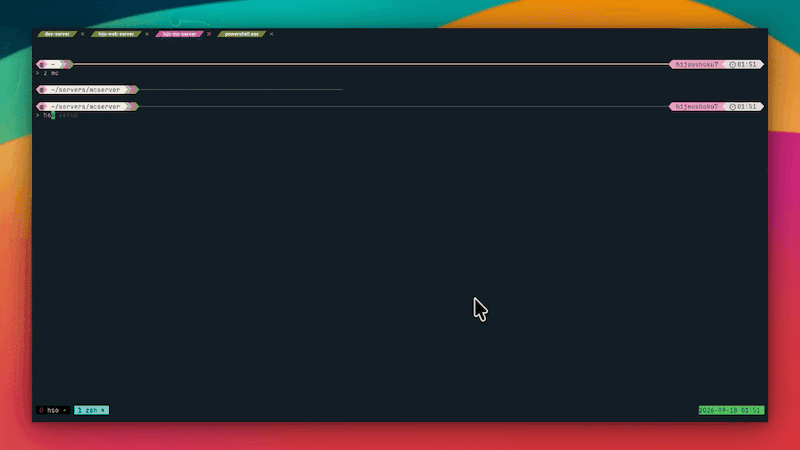
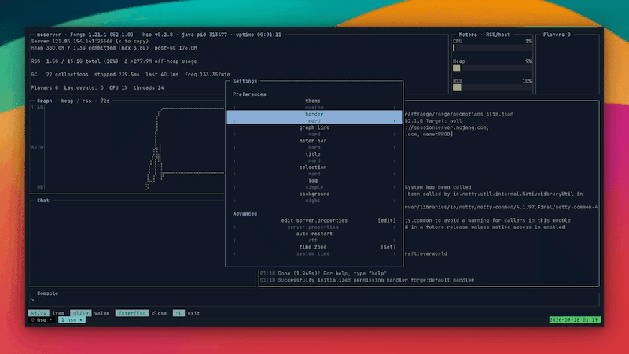
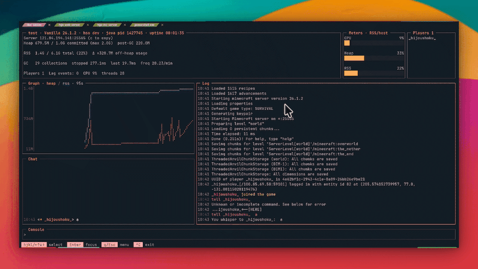
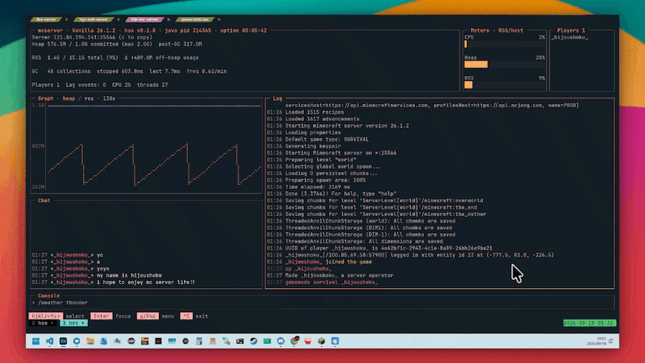

 

[English](README.md) | 日本語


## hijo Server Ops

Linuxでマイクラサーバー立てたいけどシェルコマンド?! java?! めんどくさいしもう嫌ｯ！！という方に朗報です。HSOが解決します。

Linux で使える Minecraft サーバー用の TUI 画面ソフトウェアです。サーバーのラッパーとして動くので、いま使っている*.shはそのままで構いません。
Vanilla,Spigot,Paper,Forge,NeoForge,Fabricなど様々な環境で動作します。

## 機能

- 操作可能なTUI コンソール
- 簡単な各種 loader（Fabric, Forge, NeoForge, Vanilla, Paper）の初期設定
- Heap（Java が確保したメモリ）と RSS（実際の使用メモリ）のグラフ。
- プレイヤーを選んでコマンドを実行
- チャットをコンソールと分けて表示
- 自動再起動
- javaバージョンの選択
- server.propertiesの編集

サーバー側にプラグインや MOD を入れる必要はありません。

## クイックスタート

### ユーザーインストール

`~/.local/bin` に入ります。root 権限は要りませんが、PATH の設定が必要になる場合があります。

```bash
curl -fsSL https://raw.githubusercontent.com/hijoushoku7/hijo-server-ops/main/install.sh | sh

curl -fsSL https://raw.githubusercontent.com/hijoushoku7/hijo-server-ops/main/install.sh | sh -s -- --lang ja # 日本語バージョンのインストール
```

`~/.local/bin` が PATH に無い環境では、インストール後に追記する 1 行が表示されます。

Minecraft サーバーを専用ユーザーで動かしている場合は、**そのユーザーで**実行してください。

### 全ユーザーで使いたい場合

`--system` を付けると `/usr/local/bin` に入ります。全ユーザーが使えて PATH の設定も要りませんが、root 権限が必要です。

```bash
curl -fsSL https://raw.githubusercontent.com/hijoushoku7/hijo-server-ops/main/install.sh | sh -s -- --system --lang ja
```

`sudo` は付けないでください。スクリプトは一般ユーザーの権限でダウンロードと検証を行い、`/usr/local/bin` へ置く最後の処理だけ `sudo` / `doas` を使います。この場合は更新と削除でも root 権限が要ります（→ [更新](#更新) / [アンインストール](#アンインストール)）。

コマンドの一覧は `hso` または `hso help` で表示できます（→ [コマンド一覧](dev-docs/commands.md)）。

### サーバーのセットアップ

`hso setup` でウィザードが開きます。どちらの場合にも対応します。

- **すでにサーバーがある場合**: そのディレクトリで実行し、いま使っている起動スクリプトを一覧から選びます。そのままの構成で立ち上がります。
- **新規構築の場合**: サーバーファイルを入れたいディレクトリで実行し、「新しくサーバーをインストールする」を選びます。Minecraft のバージョンとローダー（Vanilla, Paper, Fabric, Forge, NeoForge）を選んで EULA に同意すると、hso が取得して設置します。

どちらもサーバー一覧に登録されるので、2 回目以降は `hso start` で選んで起動できます。hso 本体は `sudo` で実行しないでください。

```bash
hso setup     # 初回: サーバーを用意して起動する
hso start     # 2 回目以降: 登録済みのサーバーを選ぶ
```

### サーバーの初期設定



### カスタマイズ



### コマンド



### 再起動



## 手動インストール

[Releases](https://github.com/hijoushoku7/hijo-server-ops/releases) から環境に合うアーカイブを取得して展開します。

```bash
tar xzf hso_v0.*.*_linux_amd64_ja.tar.gz
cd hso_v0.*.*_linux_amd64_ja
./hso setup
```

arm64 なら `arm64`、英語表示がよければ `_en` のアーカイブを選んでください。

## Java の切り替えと確認

```bash
hso java change [name]
hso java list
```

`change` は登録済みサーバーが使う Java を、`/usr/lib/jvm` から自動検出した候補から選んで `hso.toml` に保存します。サーバーが起動中でも変更でき、反映は次回起動からです。`list` は検出した JVM と、それぞれを使う登録済みサーバーを表示します。SDKMAN、asdf、`/opt` などの Java は自動検出されないため、使う場合は `hso.toml` の `[server] java` に JAVA_HOME の絶対パスを指定してください。

## 更新

```bash
hso update
```

最新リリースから、いま動いているものと同じアーキテクチャ・同じ表示言語のバイナリを取得し、SHA-256 で照合してから自分自身を置き換えます。すでに最新なら何もしません。

`/usr/local/bin` に入れている場合は、**置き換えの一手だけ** `sudo` / `doas` でパスワードを聞かれます。`sudo hso update` と打つ必要はありません（取得も展開も root で走ってしまいます）。`~/.local/bin` なら昇格なしで通ります。

## アンインストール

```bash
hso uninstall #アンインストール
```

ツールのアンインストールのみで、サーバーディレクトリは削除されません。削除するパスを表示して確認を取ってから、いま動いているバイナリを削除します。確認を省略するには `-y` / `--yes` を付けます。

`/usr/local/bin` に入れているバイナリだけを削除する場合は、`sudo hso uninstall` を実行します。アンインストール自身が `sudo` / `doas` を起動することはありません。

サーバー一覧と pidfile も消す場合は、**sudo を付けずに**実行します。

```bash
hso uninstall --purge #hsoの設定削除
```

`/usr/local/bin` に入れている場合は、先に通常ユーザーで設定を消し、残ったバイナリを root で削除します。

```bash
hso uninstall --purge
sudo hso uninstall
```

バイナリが壊れて `uninstall` を実行できない場合は、手動で削除できます。
`HSO_INSTALL_DIR` を指定していた場合は、1 行目をそのディレクトリ内の `hso` に読み替えてください。

```bash
rm "$HOME/.local/bin/hso"                 # または sudo rm /usr/local/bin/hso
rm -rf "${XDG_CONFIG_HOME:-$HOME/.config}/hso"
if [ -n "${XDG_RUNTIME_DIR:-}" ]; then
  rm -rf "$XDG_RUNTIME_DIR/hso"
else
  rm -rf "/tmp/hso-$(id -u)"
fi
```

pidfile は再起動でも消えます。

## ドキュメント

- [コマンド一覧](dev-docs/commands.md)
- [ビルド手順](dev-docs/build.md)
- [仕様・技術調査](dev-docs/spec.md)

## ライセンス

MIT。[LICENSE](LICENSE) を参照。

同梱する依存はそれぞれのライセンス（すべて MIT または BSD-3-Clause）に従う。
全文は [THIRD_PARTY_LICENSES.md](THIRD_PARTY_LICENSES.md) にある。

## 作者

hijoushoku https://github.com/hijoushoku7
A Student Engineer from Japan🗾
