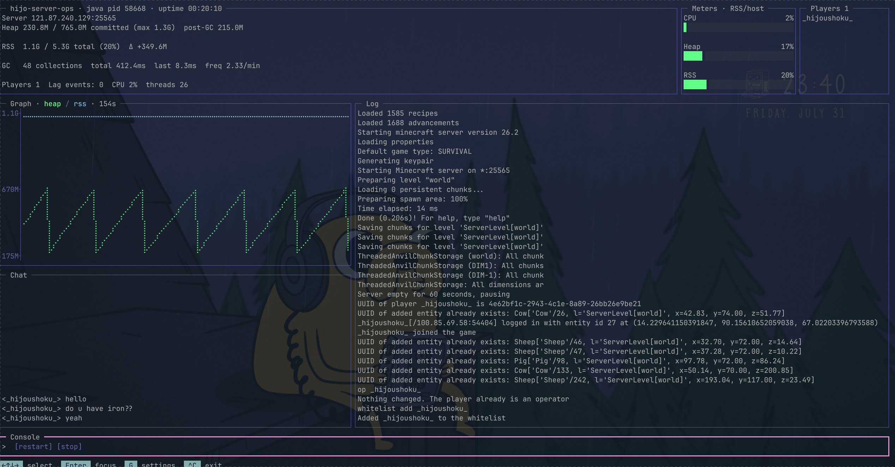

 

English | [日本語](README.ja.md)



## hijo Server Ops

A TUI console for Minecraft servers on Linux. It runs as a wrapper around your server, so the start script you already use stays as it is.
Works with Vanilla, Spigot, Paper, Forge, NeoForge, Fabric and other setups.

## Quick start

### Install system-wide (recommended)

Installs into `/usr/local/bin`. Every user can run it, and no PATH setup is needed.

```bash
curl -fsSL https://raw.githubusercontent.com/hijoushoku7/hijo-server-ops/main/install.sh | sh -s -- --system
```

Do not put `sudo` in front of the pipe. The script downloads and verifies as your normal user, and only the final move into `/usr/local/bin` uses `sudo`.

### Install into your home directory

If you have no root privileges, or would rather not use them, install into `~/.local/bin`.

```bash
curl -fsSL https://raw.githubusercontent.com/hijoushoku7/hijo-server-ops/main/install.sh | sh
```

If `~/.local/bin` is not on your PATH, the installer prints the single line to add.

The interface is English by default. Add `--lang ja` to the commands above for the Japanese build, or use the environment variable: `curl -fsSL https://raw.githubusercontent.com/hijoushoku7/hijo-server-ops/main/install.sh | env HSO_LANG=ja sh -s -- --system`. The flag takes precedence over the environment variable.

Run `hso` after installing and the setup wizard opens on the first run. Enter your server directory, pick the start script from the list, and the server comes up right away. Do not run hso itself with `sudo`.

## Features

- Heap (memory Java reserved) and RSS (memory actually used) shown separately, along with the gap between them, so you can see why the server runs out of memory even though you raised `-Xmx`
- Memory graph over time and GC statistics
- Pick a player from the list and run a command against them
- Chat pulled out of the log and shown on its own

No plugin or mod has to be installed on the server side.

## Manual install

Download the archive matching your environment from [Releases](https://github.com/hijoushoku7/hijo-server-ops/releases) and extract it.

```bash
tar xzf hso_v0.1.1_linux_amd64_en.tar.gz
cd hso_v0.1.1_linux_amd64_en
./hso
```

Pick `arm64` for arm64 machines, and the `_ja` archive if you want the Japanese interface.

## Update

```bash
hso update
```

Fetches the binary for the same architecture and same interface language as the one currently running from the latest release, verifies it with SHA-256, then replaces itself. If it is already up to date, nothing happens.

If it lives in `/usr/local/bin`, `sudo` / `doas` asks for your password **for the replacement step only**. There is no need to type `sudo hso update` (that would run the download and the extraction as root as well). In `~/.local/bin` it goes through without any elevation.

## Uninstall

```bash
hso uninstall
```

Prints the paths to be removed, asks for confirmation, and then deletes the binary that is currently running. The server list is kept, and `hso.toml` and the worlds inside your server directory are left alone. Add `-y` / `--yes` to skip the confirmation.

To remove only the binary installed in `/usr/local/bin`, run `sudo hso uninstall`. The uninstall never invokes `sudo` / `doas` by itself.

To remove the server list and the pidfile as well, run it **without sudo**.

```bash
hso uninstall --purge
```

If it is installed in `/usr/local/bin`, delete the configuration as your normal user first, then remove the leftover binary as root.

```bash
hso uninstall --purge
sudo hso uninstall
```

If the binary is broken and `uninstall` cannot run, you can remove everything by hand.
If you set `HSO_INSTALL_DIR`, read the first line as the `hso` inside that directory.

```bash
rm "$HOME/.local/bin/hso"                 # or sudo rm /usr/local/bin/hso
rm -rf "${XDG_CONFIG_HOME:-$HOME/.config}/hso"
if [ -n "${XDG_RUNTIME_DIR:-}" ]; then
  rm -rf "$XDG_RUNTIME_DIR/hso"
else
  rm -rf "/tmp/hso-$(id -u)"
fi
```

The pidfile also goes away on reboot.

## Documentation

Written in Japanese.

- [Build instructions](dev-docs/build.md)
- [Specification and technical notes](dev-docs/spec.md)

## Author

hijoushoku https://github.com/hijoushoku7
A Student Engineer from Japan🗾
